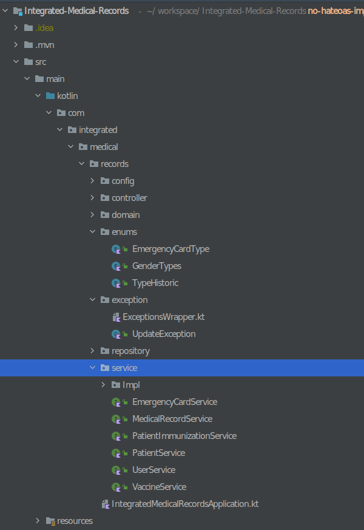
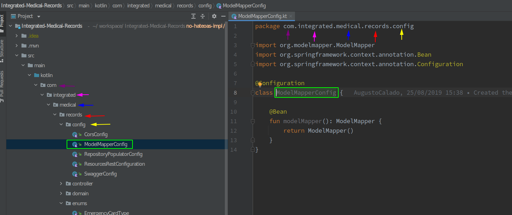

# Kotlin Fundamentals - PagSeguro Training Program
- [Kotlin Fundamentals - PagSeguro Training Program](#kotlin-fundamentals---pagseguro-training-program)
  - [Useful Links](#useful-links)
  - [Kotlin](#kotlin)
  - [Instalando e Rodando Kotlin](#instalando-e-rodando-kotlin)
    - [SDKMAN](#sdkman)
    - [Rodando Kotlin](#rodando-kotlin)
  - [Kotlin Basics](#kotlin-basics)
    - [Functions e Variables](#functions-e-variables)
      - [Variables](#variables)
      - [Functions](#functions)
      - [Verificando Tipos](#verificando-tipos)
    - [Expressions - `if else`](#expressions---if-else)
      - [Elvis Operator](#elvis-operator)
  - [Enums e `when`](#enums-e-when)
    - [Enums](#enums)
      - [Inicialização de Enums](#inicialização-de-enums)
      - [Mais sobre Enums](#mais-sobre-enums)
    - [O operador `when`](#o-operador-when)
      - [Mais sobre `when` operator](#mais-sobre-when-operator)
  - [Loops - `while` e `for`](#loops---while-e-for)
    - [`for` Loop](#for-loop)
      - [Mais sobre `for` loop](#mais-sobre-for-loop)
    - [Kotlin `while` loop](#kotlin-while-loop)
      - [Mais sobre `while` loop](#mais-sobre-while-loop)
  - [Pacotes (*Packages*)](#pacotes-packages)
  - [Classes, Objects, Interface e Properties](#classes-objects-interface-e-properties)
    - [Classes](#classes)
      - [Construtor](#construtor)
      - [Criando instâncias de classes](#criando-instâncias-de-classes)
    - [Companion objects](#companion-objects)
      - [Mais sobre Companion Objects](#mais-sobre-companion-objects)
    - [Herança](#herança)
    - [Interface](#interface)
    - [Open, final, e abstract modifiers](#open-final-e-abstract-modifiers)
  - [Exceptions](#exceptions)
    - [`try`, `catch` e `finally`](#try-catch-e-finally)
      - [`finally`](#finally)
  - [Collections and Arrays](#collections-and-arrays)
  - [Data classes](#data-classes)
      - [Mais sobre **Data Classes** loop](#mais-sobre-data-classes-loop)
  - [Vantagens de Linguagens Estaticamente Tipadas](#vantagens-de-linguagens-estaticamente-tipadas)
  - [Conceitos de Programação Funcional](#conceitos-de-programação-funcional)
  - [Null-safety](#null-safety)
    - [O que significa non-nullable por padrão?](#o-que-significa-non-nullable-por-padrão)
    - [Como isso me ajuda?](#como-isso-me-ajuda)
## Useful Links 
- https://play.kotlinlang.org/
- https://kotlinlang.org/

## Kotlin
- Home page is https://kotlinlang.org
- JetBrains criou e mantém a linguagem
- Oficialmente endossado pelo Google como uma linguagem de desenvolvimento Android
- Fornece `null safety` no nível do compilador
    - Ver sessão [Null-safety](#null-safety)
- **Estaticamente tipado**  por padrão
    - Significa que o tipo de cada expressão em um programa é conhecido em tempo de compilação
    - O compilador valida se os métodos e campos que você está tentando acessar existem nos objetos que você está usando.
    - [Vantagens de Linguagens Estaticamente Tipadas](#vantagens-de-linguagens-estaticamente-tipadas)
- Executa na JVM `-->` Interoperabilidade com Java

## Instalando e Rodando Kotlin
### SDKMAN
- `sdk install kotlin`

### Rodando Kotlin
1. Crie um aplicativo simples em Kotlin que exiba "Hello, World!". Em seu editor favorito, crie um novo arquivo chamado `hello.kt` com as seguintes linhas:

```kt
fun main() {
    println("Hello, World!")
}
```

2. Compile a aplicação usando o comando: `$ kotlinc hello.kt -include-runtime -d hello.jar`

A opção `-d` indica o caminho de saída para arquivos de classe gerados, que podem ser um diretório ou um arquivo .jar. A opção `-include-runtime` torna o arquivo .jar resultante independente e executável, incluindo Kotlin runtime library.

3. Rodando a aplicação: `java -jar hello.jar`


Para mais informações conferir: [Kotlin command-line compiler](https://kotlinlang.org/docs/command-line.html#install-the-compiler)

## Kotlin Basics
### Functions e Variables
#### Variables
- Declarando uma variavel: `val s: String`
- `val` vs `var`
    - `var` é uma variavel (mutable)
        - O valor de variáveis declaradas com `var` pode ser alterado.
    - `val` é um valor (immutable)
        - `val` não pode ser reatribuído depois de inicializado
    - Por padrão, você deve se esforçar para declarar todas as variáveis em Kotlin com a palavra-chave val.
    - **[WARNING!!]** Embora variaveis declaradas com `var`  permitam que seu valor seja alterado, seu tipo é fixo.
        - O exemplo abaixo **não irá compilar**
            ```kt
            var answer = 42
            answer = "no answer"
            ```

- Variáveis em kotlin são **non-null** por padrão
- Para declarar uma variavel que pode assumir `null` é decessário declara-lá como nullable utilizando `?`
    - Ex: `val name: String?`

- **The `!!` operator**
    - O operador de asserção não nulo (`!!`) converte qualquer valor em um tipo não nulo e **lança uma exceção se o valor for nulo**. Você pode escrever b!!, e isso retornará um valor não nulo de b (por exemplo, uma String em nosso exemplo) ou lançará um NPE se b for nulo:
    ```
    val l = b!!.length
    ```

#### Functions

```kt
fun main(args: Array<String>) {
    println("Hello, world!")
}
```

- `fun` keyword é usada para declarar uma função
- tipo de parâmetro é escrito após seu nome (ex: `args: Array<String>`)

```kt
fun max(a: Int, b: Int): Int {
    return if (a > b) a else b
}
```
- A declaração da função começa com a keyword `fun`, seguida pelo nome da função (no caso do exemplo é `max`). Depois, é seguido pela lista de parâmetros entre parênteses. O **tipo de retorno** vem após a lista de parâmetros, separado dela por dois pontos (`:`).


- Default parameter Values
    - Em Kotlin, você pode especificar valores padrão para parâmetros em uma declaração de função.
        ```
        fun max(a: Int = 0, b: Int = 0): Int {
            return if (a > b) a else b
        }
        ```

#### Verificando Tipos 

Use `is`.

```kt
val age = 25
if (age is String) { 
    println("Age is a String")
}

if (age is Int) { 
    println("Age is an In")
}

```

### Expressions - `if else` 

```kt
fun max(a: Int, b: Int): Int = if (a > b) a else b
```

```kt
fun max(a: Int, b: Int): Int {

    if(a > b) {
        return a
    } else {
        return b
    }

} 
```

#### Elvis Operator
- Quando você tem uma referência anulável, b, você pode dizer "se b não for nulo, use-o, caso contrário, use algum valor não nulo":
    ```kt
    val l: Int = if (b != null) b.length else -1
    ```
- Uma alternativa ao `if else` para verificar `null` é a utilização do **Elvis Operator** 
    ```kt
    val l = b?.length ?: -1
    ```
    - se a expressão à esquerda de `?:` não for nula, o operador Elvis a devolve, caso contrário devolve a expressão à direita.

## Enums e `when`

### Enums
- Enums em Kotlin são tipos de dados que contêm um conjunto de constantes. Enums são definidos adicionando o modificador enum na frente de uma classe, conforme mostrado abaixo.  
    - Em Kotlin, Enums são classes.

```kt
enum class Months{
    January,
    February,
    March
}
```

```kt
fun main(args: Array<String>) {

    println(Months.January) //prints January
    println(Months.values().size) //prints 3
    println(Months.valueOf("March")) //prints March

    for (enum in Months.values()) {
        println(enum.name)
    }

    println(Months.valueOf("Mar")) //throws java.lang.IllegalArgumentException: No enum constant Months.Mar
}
```

- `values()` retorna as constantes enum na forma de um array sobre o qual podemos iterar para recuperar cada constante enum.
- `valueOf()` é usado para buscar uma constante enum usando uma String como argumento.


#### Inicialização de Enums
Enums podem ser inicializadas usando construtores primários, conforme mostrado abaixo.

```kt
enum class Months(var shorthand: String) {
    January("JAN"),
    February("FEB"),
    March("MAR");
}
```
#### Mais sobre Enums
[Kotlin Enum Class](https://www.journaldev.com/18688/kotlin-enum-class)

### O operador `when`
- Use `when` quando um determinado bloco de código precisa ser executado quando alguma condição é cumprida.

```kt
var num = 10
    when (num) {
        0 -> print("value is 0")
        5 -> print("value is 5")
        else -> {
            print("value is neither 0 nor 5") //this gets printed.
        }
    }
```

- O operador `when` corresponde ao argumento com todas as ramificações. Se não corresponder a nenhum, a instrução `else` será executada.
- `when` operador pode ser usado para retornar valores também, semelhante a if else.

```kt
var valueLessThan100 = when(101){
        in 1 until 101 -> true
        else -> {
            false
        }
    }
    
    print(valueLessThan100) //false
```

#### Mais sobre `when` operator
[Kotlin when expression](https://www.geeksforgeeks.org/kotlin-when-expression/)

## Loops - `while` e `for`

### `for` Loop
- O loop `for` é usado para iterar sobre uma lista de itens com base em determinadas condições.
- A seguir está a implementação de loops `for` em Kotlin para imprimir números de 0 a 5.

```kt
for (i in 0..5) {
    print(i)
}
```

- Outro caso para você, onde iteramos sobre uma matriz usando o loop `for-in`.
```kt 
val items = listOf(10, 20, 30, 40)

    for (i in items)
        println("value is $i")

//Following is printed to the console.
value is 10
value is 20
value is 30
value is 40
```

#### Mais sobre `for` loop
[Kotlin `for` Loop](https://www.journaldev.com/18483/kotlin-control-flow-if-else-for-while-range#:~:text=a%0Amax%20is%205-,Kotlin%20for%20loop,-The%20syntax%20of)


### Kotlin `while` loop
`while` loop – consiste em um bloco de código e uma condição. Em primeiro lugar, a condição é avaliada e, se for verdadeira, execute o código dentro do bloco. Ele se repete até que a condição se torne falsa porque toda vez que a condição é verificada antes de entrar no bloco.

```kt
while(condition) {
           // code to run
}
```

[](./resources/kotlin-while.jpg)

```kt
i=0
while(i<=5) {
    print(i)
    i++
}

//prints 012345
```

#### Mais sobre `while` loop
[Kotlin while loop](https://www.geeksforgeeks.org/kotlin-while-loop/?ref=lbp)


## Pacotes (*Packages*)
- Usados pacotes para agrupar classes relacionadas
- Pacotes são declarados com a palavra-chave package
- https://kotlinlang.org/docs/packages.html




## Classes, Objects, Interface e Properties

### Classes
As classes em Kotlin são declaradas usando a keyword `class`:

```kt
class Person { /*...*/ }
```

#### Construtor 
Uma classe em Kotlin pode ter um construtor primário e um ou mais construtores secundários.

- **Primary Constructor**
    - O construtor primário não pode conter nenhum código.
        ```kt
        class Person(firstName: String) { /*...*/ }

        class Person(val firstName: String, val lastName: String, var age: Int)
        ```

- **Exercício: Ler sobre o bloco `init` ([Init Blocks Kotlin Constructors](https://kotlinlang.org/docs/classes.html#constructors))**


- **Secondary Constructor**
    - Uma classe também pode declarar construtores secundários, que são prefixados com `construtor`
    - Construtores secundários permitem a inicialização de variáveis e também fornecem alguma lógica para a classe
        ```kt
        class Pet {
            constructor(owner: Person) {
                owner.pets.add(this) 
            }
        }

        class Add {
            constructor(a: Int, b:Int) {
                var c = a + b
                println("The sum of numbers 5 and 6 is: ${c}")
            }
        }
        ```
- **Exercício: Ler sobre algumas formas de se utilizar `Secondary Constructor` ([Init Blocks Kotlin Constructors](https://www.geeksforgeeks.org/kotlin-constructor/?ref=lbp))**

#### Criando instâncias de classes
```kt
val invoice = Invoice()

val customer = Customer("Joe Smith")
```

### Companion objects
Em Kotlin, se você deseja escrever uma função ou qualquer membro da classe que possa ser chamado sem ter a instância da classe, você pode escrever o mesmo como um membro de um objeto companheiro dentro da classe. Assim, ao declarar o companion object, você pode acessar os membros da classe apenas pelo nome da classe (sem criar explicitamente a instância da classe).

```kt
class SomeNiceClass {

    companion object CompanionObject {

    }
}
val obj = SomeNiceClass.CompanionObject
```

```kt
class ToBeCalled {
    companion object Test {
        fun callMe() = println("You are calling me :)")
    }
}
fun main(args: Array<String>) {
    ToBeCalled.callMe()
}
```

#### Mais sobre Companion Objects
[Kotlin Companion Objects](https://blog.mindorks.com/companion-object-in-kotlin)

### Herança
A herança é um dos recursos mais importantes na programação orientada a objetos. A herança permite a reutilização de código, permite que todos os recursos de uma classe existente (classe base) sejam herdados por uma nova classe (classe derivada). Além disso, a classe derivada também pode adicionar alguns recursos próprios.

```kt
open class baseClass (x:Int ) {
      ..........
}
class derivedClass(x:Int) : baseClass(x) {
     ...........
}
```
Em Kotlin, todas as classes são **final** por padrão. Para permitir que a classe derivada herde da classe base, devemos usar a palavra-chave open na frente da classe base.

```kt
//base class
open class BaseClass{
    val name = "Augusto"
    fun printName(){
        println("Base Class")
    }
}
//derived class
class DerivedClass: BaseClass() {
    fun printNameWithInfo(info: String) {
        println("${name} + ${info}" ) //inherit **name** property
    }
}
fun main(args: Array<String>) {
    val derived: DerivedClass = DerivedClass()
    derived.printName()         // inheriting the  base class function
    derived.printNameWithInfo("Developer")         // calling derived class function

    val baseclass = DerivedClass() // What is going to happen here?
}
```

### Interface

- Declarando uma interface:
    ```kt
    interface Clickable {
        fun click()
    }
    ```

- Implementando uma interface
    ```kt
    class Button : Clickable {
        override fun click() = println("I was clicked")
    }
    ```

### Open, final, e abstract modifiers

**Estudo recomendado:** Ler o Cap 4. Classes, objects, and interfaces de JEMEROV, Dmitry and ISAKAVA, Svetlana. Kotlin in Action, 2017.

## Exceptions
- Uma função pode ser concluída de maneira normal ou lançar uma exceção se ocorrer um erro. O chamador da função pode capturar essa exceção e processá-la.

```kt
if (percentage !in 0..100) {
    throw IllegalArgumentException(
        "A percentage value must be between 0 and 100: $percentage")
}
```

### `try`, `catch` e `finally`
- Para lidar com exceções, usamos o `try-catch` block.
- O pedaço de código que tem a possibilidade de dar uma exceção é definido dentro do bloco `try`. A exceção é capturada dentro do bloco `catch`. Independentemente do que acontece, o bloco `finally` é sempre executado.

```kt
fun main(args: Array<String>) {
    try {

        var a = 0
        var x = 7 / a

        val v = "Journaldev.com"
        v.toInt()

    } catch (e: ArithmeticException) {
        println("Arthimetic Exception")
    } catch (e: Exception) {
        println("Exception occured. To print stacktrace use e")
    } finally {
        println("Finally. It's over")
    }
}
```

#### `finally`
- **Exercício: Busquem na internet os casos de uso do block `finally`**

## Collections and Arrays
```kt
val set = hashSetOf(1, 7, 53)
val list = arrayListOf(1, 7, 53)
val map = hashMapOf(1 to "one", 7 to "seven", 53 to "fifty-three")
```

- **Exercício: Qual a diferença entre as estruturas set, list e map em Kotlin?**

## Data classes
- Não é incomum criar classes cujo objetivo principal seja armazenar dados. Em tais classes, algumas funcionalidades padrão e algumas funções utilitárias são frequentemente deriváveis mecanicamente a partir dos dados. Em Kotlin, elas são chamadas de classes de dados e são marcadas com dados:

```kt
data class User(val name: String, val age: Int)
```

- O compilador cria automaticamente os seguintes membros de todas as propriedades declaradas no construtor primário:

-` equals()`/`hashCode()` pair

- `toString()` no formato  "User(name=John, age=42)"

- `componentN()` funções correspondentes às propriedades em sua ordem de declaração.

- `copy()` function

- Para garantir consistência e comportamento significativo do código gerado, as data classes devem atender aos seguintes requisitos:

    - O construtor primário precisa ter pelo menos um parâmetro.

    - Todos os parâmetros do construtor primário precisam ser marcados como `val` ou `var`.

    - As classes de dados não podem ser abstratas, abertas, sealed ou internas.


#### Mais sobre **Data Classes** loop
[Kotlin Data classes](https://kotlinlang.org/docs/data-classes.html)

## Vantagens de Linguagens Estaticamente Tipadas
A seguir estão alguns dos benefícios da tipagem estática:

- Desempenho— Chamar métodos é mais rápido porque não há necessidade de descobrir em tempo de execução qual método precisa ser chamado.
- Confiabilidade— O compilador verifica a exatidão do programa, portanto, há menos chances de travamentos em tempo de execução.
- Manutenibilidade— Trabalhar com código desconhecido é mais fácil porque você pode ver com que tipo de objetos o código está trabalhando.
- Suporte a ferramentas— A tipagem estática permite refatorações confiáveis, preenchimento de código preciso e outros recursos do IDE.

## Conceitos de Programação Funcional
- First-class functions— Você trabalha com funções (partes de comportamento) como valores. Você pode armazená-los em variáveis, passá-los como parâmetros ou retorná-los de outras funções.
- Immutability— Você trabalha com objetos imutáveis, o que garante que seu estado não possa mudar após sua criação.
- No side effects— Você usa funções puras que retornam o mesmo resultado com as mesmas entradas e não modificam o estado de outros objetos ou interagem com o mundo exterior.

## Null-safety
### O que significa non-nullable por padrão? 
```kt
fun main() {
  word: String
  print(word); // illegal

  word = 'Hello';
  print(word); // legal
}
```
Como você pode ver acima, uma variável não anulável por padrão significa que toda variável declarada normalmente não pode ser nula. Conseqüentemente, qualquer operação que acesse a variável antes de ser atribuída é ilegal.
Além disso, atribuir null a uma variável não anulável também não é permitido:


```kt
fun main() {
  word: String
  word = null // forbidden
  world = 'World!' // allowed
}
```

### Como isso me ajuda?
Se uma variável não for non-nullable, você pode ter certeza de que ela nunca será nula. Por isso, você nunca precisa verificar antes.

```kt
number: Int = 4;

fun main() {
  if (number == null) return; // redundant

  sum: Int = number + 2; // allowed because number is also non-nullable
}
```
