# Object-Oriented Programming


## Paradigma
> Forma de conceituar o que significa realizar computação e como tarefas executadas no computador dever ser estruturadas e organizadas
> \- Budd, 2001

### Alguns Paradigmas
- Imperativo
  - Estado e comandos de mudanças do estado global
  - Linguagens: Pascal, **C** e Cobol
- Funcional
  - TODO
  - Linguagens: Lisp, Haskel, ML e Scala
- Lógico
  - Metas e Lógicas de predicados
  - Linguagens: Prolog
- Orientado a Objetos


### Qual é o melhor paradigma?
- Depende do problema
- A solução de um problema computacional é influenciada pelo paradigma seguido
  - Facilidade/ dificuldade de representação
  
### Algumas Linguagens são Multiparadigma
- Exemplo: Java e Kotlin
  - Orientado a Objetos
  - Funcional (ex: expressões lambda)


## Pacotes
- Utilizado para o agrupamento (lógico e físico) classes

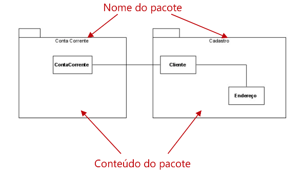


- Serve de um espaço de nomes (*namespace*) para classes
    - Classes podem ter o mesmo nome desde que estejam em pacotes diferentes 

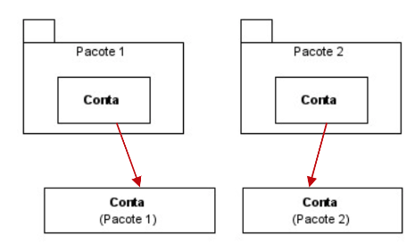

## Herança
- Existem classes que representam conceitos similares
    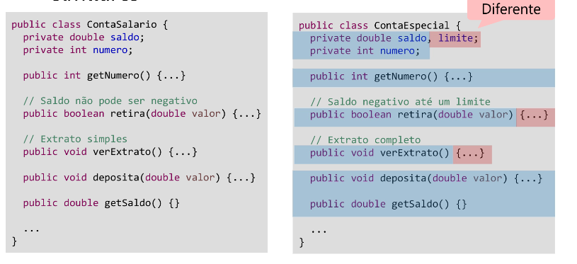

### Problema
- Apesar de serem classes semelhantes, são **tipos** diferentes


- **Impacto**
    - Muita duplicação de código!!!
        - Responsabilidades comuns
        - Qual é o problema da duplicação de código?
            - DRY: "Don't Repeat Yourself"
    - Interface não consistente
        -  tipos diferentes: não é possível unifica-los
        -  Classes com métodos similares, mas não necessariamente com nomes e assinaturas iguais
    -  **Como resolver isso?**

### Herança
- Representa hierarquia entre classes
    - Abstração em **especialização** e **generalização**
    - relacionamento entre itens gerais e específicos
    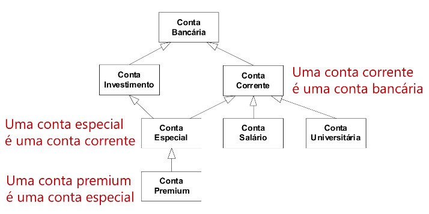

#### Especialização
- A classe filha herda operações e atributos
- Definição de novos comportamentos e atributos

  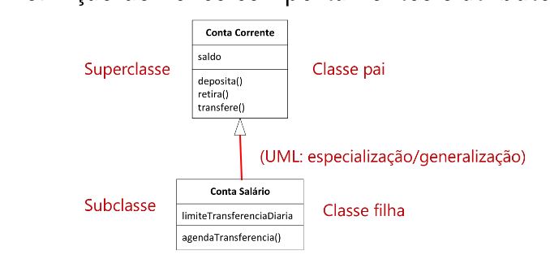

- Não existem ciclos de hierarquia!
- **Redefinição**
    - Alteração do comportamento já definido
        - Precisa ter a mesma **assinatura**
        - (Não é possível redefinir atributos)
        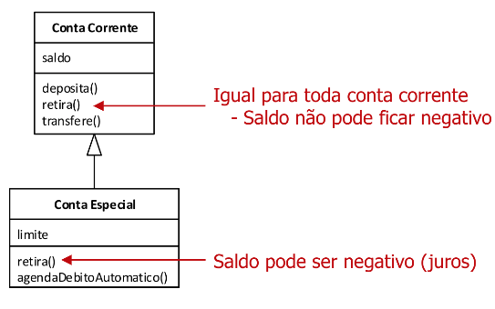
        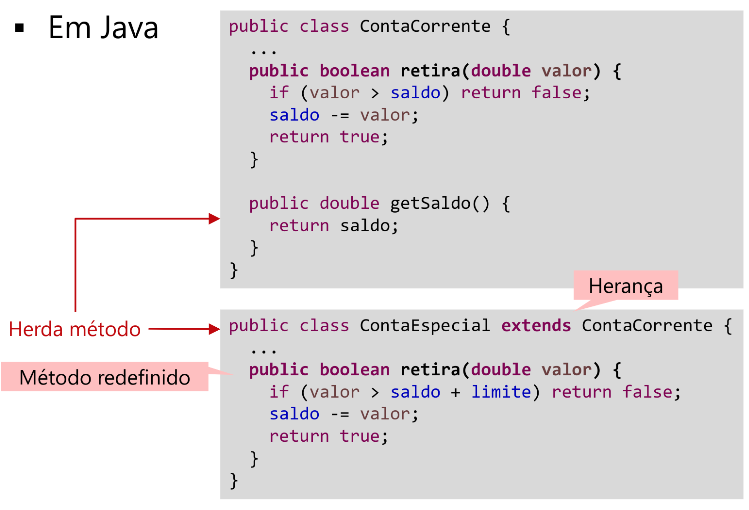


### Polimorfismo
- Um nome pode ter diferentes significados
    - Permite o reuso de código
- Formas de polimorfismo
    - Sobrecarga de operação (overload)
    - Redefinição de operação (override)
    - Variável polimórfica

#### Sobrecarga de operação
- Um mesmo nome de operação pode ter diversas implementações
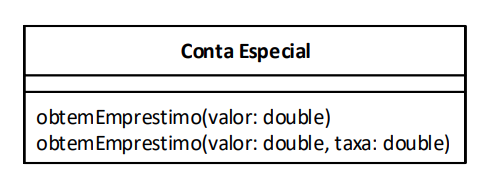
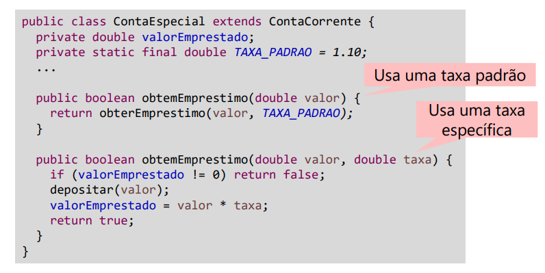

#### Redefinição de operação 
- Recurso da herança 
    - Uma operação pode ser redefinida na subclasse
    - Permite a especialização de comportamento

- Exemplo em java:
``` 
@Override
public boolean retira(double valor) {...}
```

- Exemplo em kotlin:
``` 
override fun retira(valor: Double): Boolean { ... }
```

- Independente do tipo da variável, se quer usar o método mais especializado
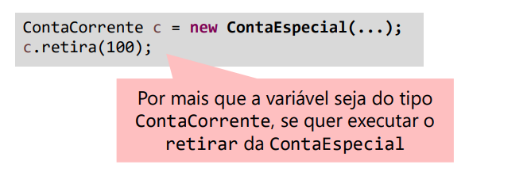

- É possível definir que algumas operações não podem ser redefinidas:
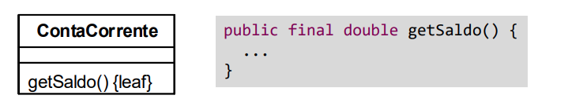

- E também que uma classe não pode ser herdada
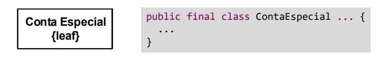

#### Variavel Polimórfica
- Variável de um tipo que carrega outro tipo
    - Pode referenciar mais de um tipo de objeto

```
List<ContaCorrente> contas = new ContaCorrente[3];
contas.add(new ContaUniversitaria(1234, 100.0));
contas.add(new ContaEspecial(1235, 200.0));
contas.add(new ContaSalario(1236, 1000.0, contas.get(1));
contas.forEach(x -> x.depositar(100.00d));
```